# Kalman Examples
https://arxiv.org/abs/2210.14878

## Setup
```
pip install .
```

## Examples
```
python3 examples/example1.py
```
### Response
#### State x
Mass = 20 kg
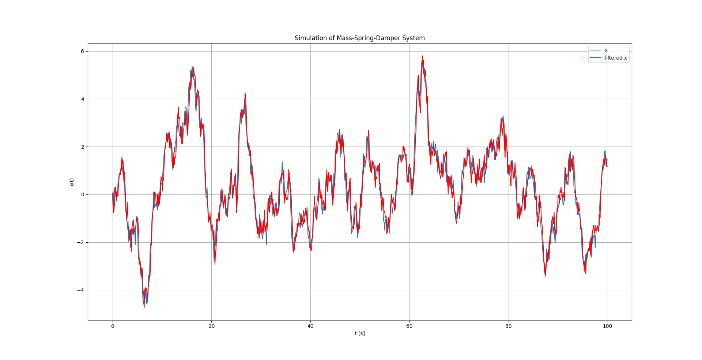
Mass = 5 kg
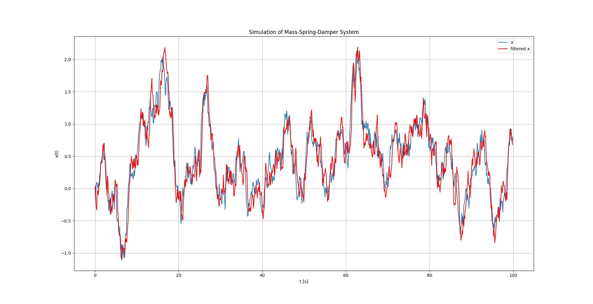

#### State y
Mass = 20 kg
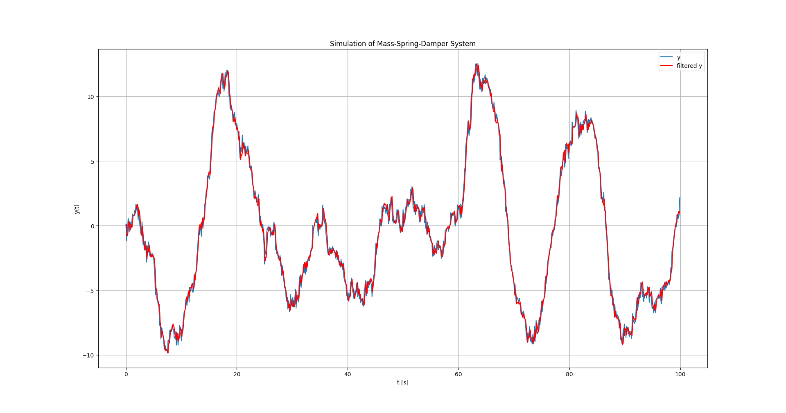
Mass = 5 kg


### Error
Mass = 20 kg
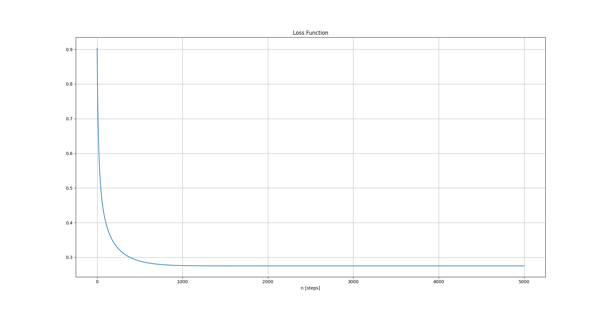
Mass = 5 kg
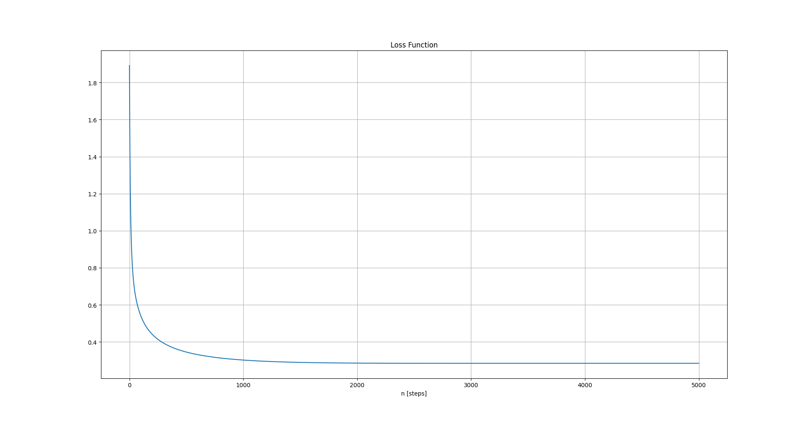

### Kalman Gain
Mass = 20 kg
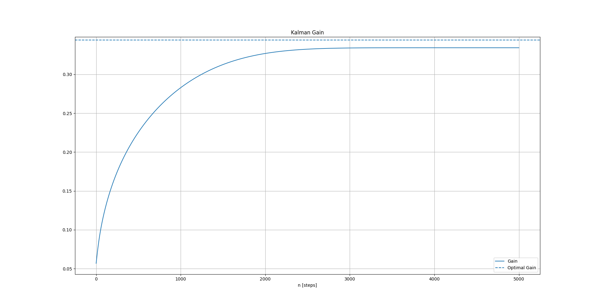
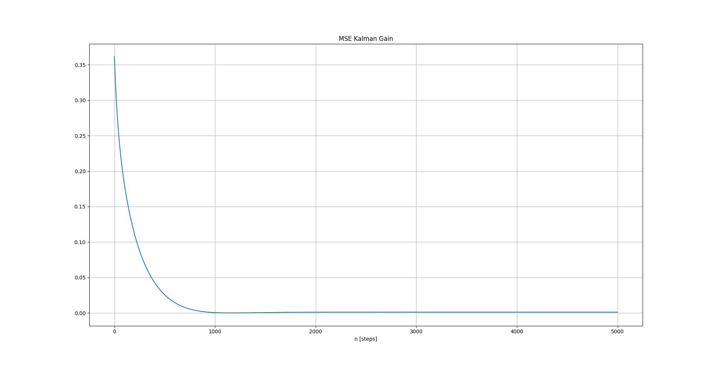
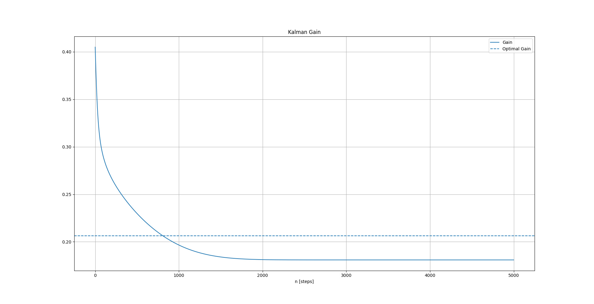
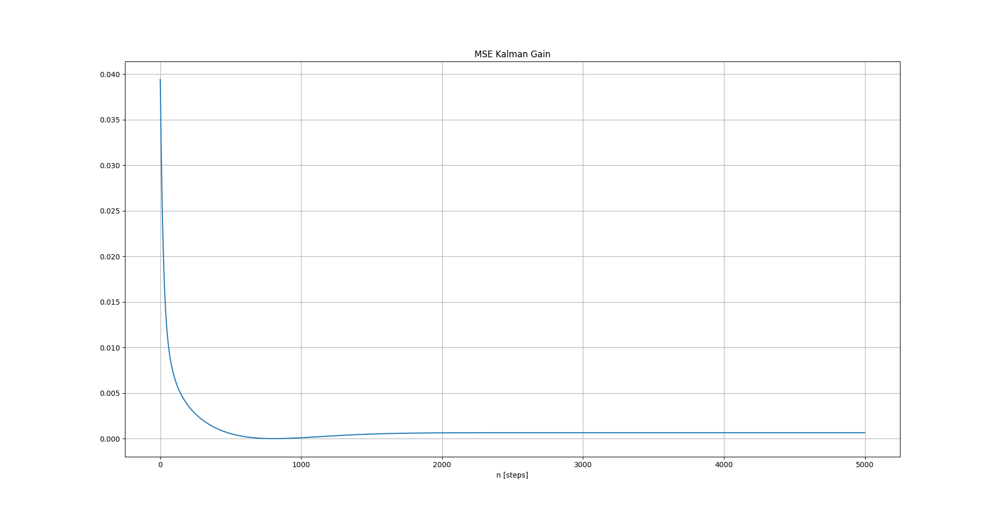
Mass = 5 kg
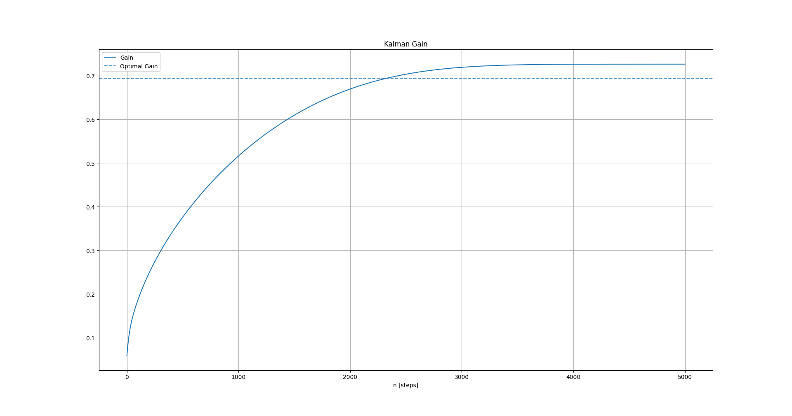
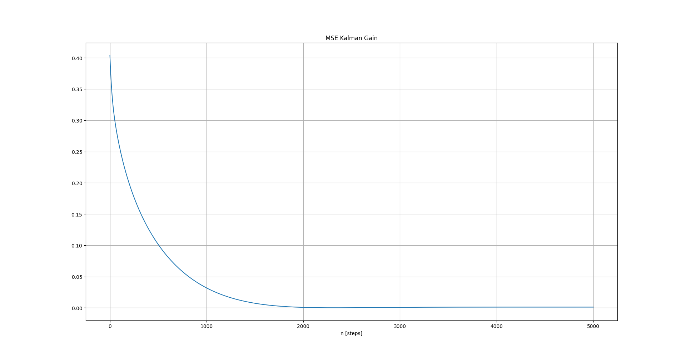
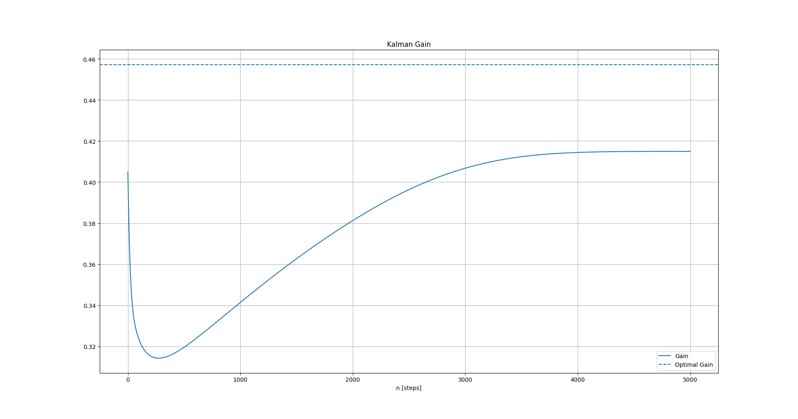
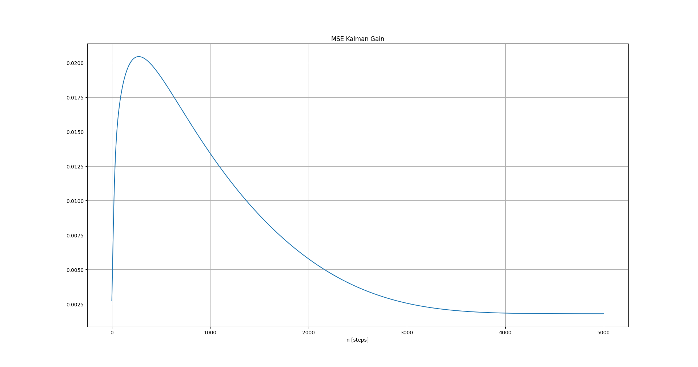


