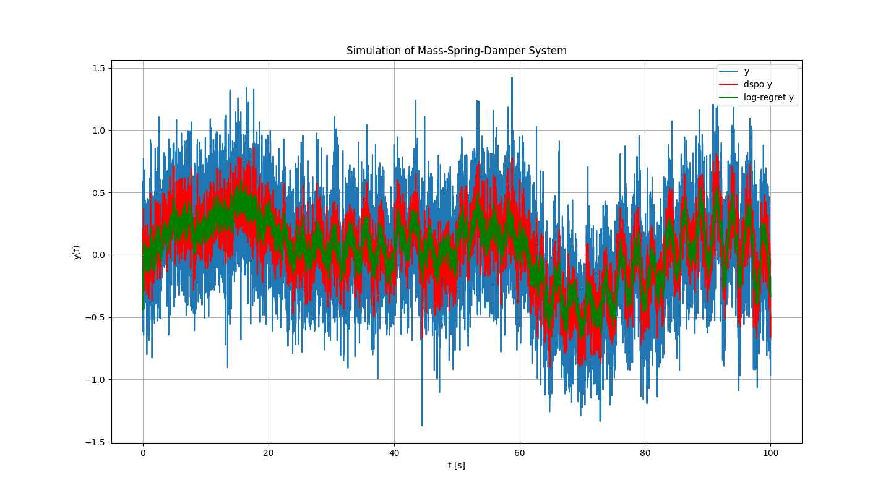

# Kalman Examples
https://arxiv.org/abs/2210.14878

[Colab Demo](https://colab.research.google.com/drive/1KPn_slEGinYSy-zqQ662MZrHwI7StI4N?usp=sharing)

## Setup
```
pip install .
```

## Examples
```
python3 examples/example1.py
```

Mass = 20 kg  
Damping Coefficient = 4 N/(ms^-1)  
Spring Stiffness = 2 N/m  
Force = 10 N  
Number of Mass-Spring-Damper System in Series = 3  

### Response
#### Response y


### Error


### Kalman Gain


### MSE Kalman Gain for different n_series


